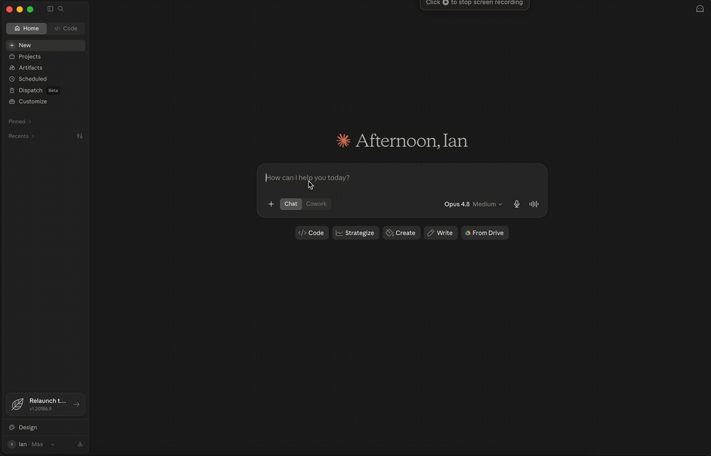

# StandardGraph

**The alignment layer for the global curriculum.** Map any standard to its equivalent in another country or exam board — cross-border alignment no single-country tool provides.

175,738 standards across 310 curriculum systems in 50+ countries, cross-walked into a single graph and accessible via Claude.

> 🎯 **Every crosswalk in the graph is now quality-scored.** All 208,442 crosswalks carry a 1–5 LLM quality score (100% coverage) — spanning the 88,944 direct country-to-country math edges and every hub-centric mapping across all seven subjects. Weak matches are automatically suppressed and results are ranked by real alignment quality, so what you get back is the strongest match first.

> ⚡ **Try it in 30 seconds — no install.** In Claude, go to **Settings → Connectors → Add custom connector** and paste `https://standardgraph.walkmakewalk.com/mcp`. No download, no token. ([full instructions ↓](#install))

Covers Mathematics, Science, ELA, Social Studies, Computer Science, Arts, and World Languages — US national and state standards plus major international curricula. Ask Claude to look up any standard, trace a concept across grade levels, or find the equivalent in another country's curriculum.

**Who this is for:**

- **EdTech engineers & curriculum teams** — mapping content to standards, building alignment features, or auditing coverage across states and countries without hand-building a crosswalk.
- **Teachers and curriculum specialists moving between systems** — "I taught IB in Singapore, now I'm teaching CCSS in Texas — what's actually different at this grade level?"

If you're doing either of those by hand today, this replaces the spreadsheet.




---

## Install

### Option A — Hosted connector (no install) ⚡

The fastest way to try it — no download, no terminal. In Claude, go to **Settings → Connectors → Add custom connector**, name it `StandardGraph`, and paste this URL:

```
https://standardgraph.walkmakewalk.com/mcp
```

Connect, and StandardGraph's tools are available in any conversation. Works in Claude on web, desktop, and mobile. *(Custom connectors require a paid Claude plan. The hosted server runs on modest hardware — ideal for trying it out and light use; for heavy or offline use, install locally below.)*

### Option B — Local install (offline / self-host)

Runs entirely on your machine against a local copy of the database. Requires [Claude Desktop](https://claude.ai/download). Open Terminal and run:

```bash
curl -fsSL https://raw.githubusercontent.com/swoopeagle/standardgraph/main/install.sh | bash
```

Then **quit and reopen Claude Desktop**. Look for the 🔨 icon in a new conversation.

> The installer handles everything: downloads the pre-built database (~2.1 GB), installs dependencies, and patches your Claude config automatically.

**Optional: better semantic search**

Install [Ollama](https://ollama.com) and pull the embedding model for richer concept matching:

```bash
brew install ollama
ollama pull nomic-embed-text
```

Without Ollama, StandardGraph falls back to keyword search — still useful, but semantic search finds conceptually related standards even when the exact words don't match. See [docs/install.md](docs/install.md) for full setup details.

**Try it:**
```
List all available curriculum systems
```
```
How does CCSS build fractions from grade 3 to 6?
```
```
What's the Singapore equivalent of CCSS.MATH.6.RP.A.3?
```
```
Find Texas ELA standards related to argumentative writing in grades 9-10
```
```
How does the C3 Framework approach civics compared to California's social studies standards?
```

→ Full install guide: [docs/install.md](docs/install.md) · First-time user guide: [docs/quickstart.md](docs/quickstart.md)

---

## Coverage

> International coverage is deepest in **Mathematics, Science, and ELA**. Social Studies, Computer Science, World Languages, and Arts are US/AP-focused today, with international expansion in progress.

### Mathematics

| Region | Systems |
|---|---|
| 🇺🇸 United States | `ccss` (hub) + all 50 states + DC |
| 🎓 Advanced Placement | `ap-calc-ab` `ap-calc-bc` `ap-stats` `ap-precalc` |
| 🇨🇦 Canada | `ca-ab` `ca-bc` `ca-on` `ca-mb` `ca-sk` `ca-nb` `ca-qc` |
| 🌍 International Baccalaureate | `ib-pyp` `ib-myp` `ib-dp` |
| 🌍 Other International | `cambridge` `aero` `dodea` |
| 🇦🇺 Australia | `au-acara` `au-vic` |
| 🇬🇧 United Kingdom | `uk-nc` `uk-aqa` `gb-sco` |
| 🇸🇬 Singapore | `sg-moe` |
| 🇯🇵 Japan | `jp-mext` (Grades 1–9) |
| 🇰🇷 South Korea | `ko-ncic` |
| 🇩🇪 Germany | `de-kmk` |
| 🇫🇮 Finland | `fi-oph` |
| 🇨🇿 Czech Republic | `cz-msmt` |
| 🇪🇸 Spain | `es-lomloe` |
| 🇧🇷 Brazil | `br-bncc` |
| 🇲🇽 Mexico | `mx-sep` `mx-dgb-ems` |
| 🇨🇱 Chile | `cl-mineduc` `cl-mineduc-sec` |
| 🇨🇴 Colombia | `co-men` |
| 🇵🇪 Peru | `pe-minedu` |
| 🇺🇾 Uruguay | `uy-anep` |
| 🇳🇿 New Zealand | `nz-moe` |
| 🇮🇪 Ireland | `ie-ncca` |
| 🇭🇰 Hong Kong | `hk-edb` |
| 🇮🇳 India | `in-ncert` |
| 🇵🇭 Philippines | `ph-deped` |
| 🇬🇭 Ghana | `gh-nacca` |
| 🇿🇦 South Africa | `za-caps` |
| 🇷🇼 Rwanda | `rw-reb` |

### Science

| Region | Systems |
|---|---|
| 🇺🇸 United States | `ngss` (hub, K–12) + all 50 states + DC |
| 🎓 Advanced Placement | `ap-bio` `ap-chem` `ap-phys-1` `ap-phys-2` `ap-phys-c-mech` `ap-phys-c-em` `ap-env` |
| 🌍 International Baccalaureate | `ib-dp-bio` `ib-dp-chem` `ib-dp-physics` `ib-dp-ess` `ib-myp-science` |
| 🌍 International | `au-acara` `ca-on` `gb-sco` `gh-nacca` `ie-ncca` `ke-kicd` `na-nied` `ng-nerdc` `sg-moe` `tz-tie` `ug-ncdc` `uk-nc` `zm-cdc` `zw-zimsec` |

### ELA (English Language Arts)

| Region | Systems |
|---|---|
| 🇺🇸 United States | `ccss-ela` (hub, K–12) + 49 states |
| 🎓 Advanced Placement | `ap-english-lang` `ap-english-lit` |
| 🌍 International Baccalaureate | `ib-dp-english-a` `ib-myp-english` |
| 🌍 International | `au-acara` `ca-on` `gb-sco` `gh-nacca` `ie-ncca` `ke-kicd` `na-nied` `ng-nerdc` `sg-moe` `tz-tie` `ug-ncdc` `uk-nc` `zm-cdc` `zw-zimsec` |

### Social Studies

US state coverage only; international Social Studies is planned.

| Region | Systems |
|---|---|
| 🇺🇸 United States | `c3` (C3 Framework hub, K–12) + 50 states |
| 🎓 Advanced Placement | `ap-us-history` `ap-world-history` `ap-euro-history` `ap-us-gov` `ap-comp-gov` `ap-human-geo` `ap-psych` `ap-macro-econ` `ap-micro-econ` `ap-art-history` `ap-african-american-stud` `ap-seminar` `ap-research` |
| 🌍 International Baccalaureate | `ib-dp-history` `ib-dp-geography` `ib-dp-economics` `ib-dp-psych` `ib-myp-ss` |

### Computer Science

| Region | Systems |
|---|---|
| 🇺🇸 United States | `csta` (CSTA 2017 hub, K–12) + 11 states (coverage expanding) |
| 🎓 Advanced Placement | `ap-cs-a` `ap-cs-principles` |
| 🌍 International Baccalaureate | `ib-dp-cs` `ib-myp-design` |

### World Languages

| Region | Systems |
|---|---|
| 🎓 Advanced Placement | `ap-spanish-lang` `ap-spanish-lit` `ap-french` `ap-german` `ap-italian` `ap-japanese` `ap-chinese` `ap-latin` |

### Arts

| Region | Systems |
|---|---|
| 🎓 Advanced Placement | `ap-music-theory` `ap-2d-art` `ap-3d-art` `ap-drawing` |

> Run `list_systems` in Claude for a live count — the pipeline updates nightly.

---

## Using with Claude

StandardGraph works out of the box once installed, but pasting the following into your **Claude Project instructions** (Settings → Projects → [your project] → Instructions) gives Claude better guidance on how to use the tools and how to interpret results:

<details>
<summary>Copy this into your Claude Project instructions</summary>

```
You are a K-12 curriculum expert with access to StandardGraph — a database of 175,000+ standards across 310 curriculum systems in 50+ countries, covering Math, Science, ELA, Social Studies, Computer Science, Arts, and World Languages.

## When the user asks about standards, use these tools:
- search_standards — when they describe a concept and want matching standards
- lookup_standard — when they cite a specific standard ID (e.g. CCSS.MATH.6.RP.A.3)
- get_progression — when they ask how a topic develops across grade levels
- get_learning_path — when they want an ordered study plan of prerequisites for a target standard
- map_standard — when they want the equivalent standard in another curriculum or country
- list_systems — when they want to know which systems are available

## Reading crosswalk confidence scores:
- ≥ 0.90: Strong match — same concept, aligned grade level
- 0.85–0.89: Good match — same concept, may differ by ±1 grade
- 0.75–0.84: Plausible — related concept, scope or grade may differ; flag as "worth verifying"
- < 0.75: Weak — treat as a starting point only, not a definitive equivalent

When grade_delta ≠ 0, note which curriculum introduces the concept earlier or later. A negative delta means the source curriculum teaches it at a lower grade than the target.

## Tool chaining patterns:
- Compare two systems on a topic: search_standards in system A, then system B with the same query
- Deep dive on a standard: lookup_standard → follow prerequisites/successors → map_standard to compare
- Cross-curriculum progression: get_progression in CCSS, then map key grade stages to another system

## Known limitations — read before using map_standard or list_systems:
- **Crosswalks are stored one-directional** (non-hub → hub, e.g. sg-moe → ccss), not mirrored. Mapping
  *from* a hub to a non-hub system (e.g. "what's the Singapore equivalent of this CCSS standard?") often
  falls through to a weaker semantic fallback even when a strong reverse mapping exists. **Always call
  map_standard with the non-hub/state/international/AP system as from_system and the subject's hub
  (ccss, ngss, ccss-ela, c3, csta) as to_system** — flip the user's framing if needed, then present the
  result in the direction the user actually asked about. Mapping between two non-hub systems directly
  (e.g. Singapore → UK) is also less reliable than routing through the hub.
- **list_systems' region filter has metadata gaps** — some international systems are tagged inconsistently
  and a region like "Sub-Saharan Africa" may under-match. Prefer filtering by subject alone, or reference
  systems by their code directly, rather than relying on region to enumerate everything available.

## Always note:
Crosswalk mappings are NLP-generated (cosine similarity), not human-verified. Present them as "closest available match" rather than "equivalent." For high-stakes decisions — student placement, curriculum adoption, teacher credentialing — recommend expert review for any mapping below 0.85 confidence.
```

</details>

StandardGraph also ships three **MCP prompt templates** that Claude can invoke directly. In a conversation with StandardGraph connected, try:
- `/curriculum_assistant` — sets Claude up as a curriculum specialist for the session
- `/compare` — side-by-side comparison of two curriculum systems on a topic
- `/find_equivalent` — maps a specific standard ID into another curriculum

---

## Tools

| Tool | What it does |
|---|---|
| `search_standards` | Find standards matching a concept or skill in plain English |
| `lookup_standard` | Fetch a standard by ID with full text, prerequisites, and successors |
| `get_progression` | Trace how a concept develops across grade levels |
| `get_learning_path` | Return an ordered study plan — every prerequisite for a target standard, from the LLM-validated prerequisite graph |
| `map_standard` | Find the closest equivalent in another curriculum system |
| `list_systems` | Live count of all indexed systems and standards |

**More examples:**
- *"Find NGSS standards related to climate change in middle school"*
- *"Compare how Texas and California cover argumentative writing in high school ELA"*
- *"What CSTA standards correspond to loops and conditionals?"*
- *"How does the C3 Framework approach historical thinking vs. Virginia's SOL social studies?"*
- *"Map CCSS.MATH.6.RP.A.3 to the Singapore curriculum"*

---

## How it works

**Ingestion** — US and Canadian standards come from [commonstandardsproject.com](https://commonstandardsproject.com). International standards are extracted from official PDF syllabuses using Gemma 4 31B (via Ollama) to parse curriculum text into structured JSON. AP course standards are extracted from College Board Course and Exam Descriptions the same way.

**Embeddings** — Every standard is embedded with `nomic-embed-text` (768 dims) and stored in SQLite.

**Crosswalk** — Each subject has a hub standard. NLP cosine similarity maps every non-hub standard to its closest hub match:

| Subject | Hub |
|---|---|
| Mathematics | CCSS Math |
| Science | NGSS |
| ELA | CCSS ELA |
| Social Studies | C3 Framework |
| Computer Science | CSTA K-12 (2017) |

`map_standard` supports direct lookup, two-hop bridging (any-to-any via hub), and semantic embedding fallback.

**MCP server** — FastMCP over stdio, six tools.

---

## Stack

- **uv** workspace monorepo
- **FastMCP** (stdio transport)
- **SQLite** — standards, embeddings (BLOBs), relationships, crosswalk mappings
- **nomic-embed-text** via Ollama — 768-dim embeddings
- **Gemma 4 31B** via Ollama — PDF→JSON extraction for international and AP curricula

---

## Research foundation

StandardGraph's crosswalk engine is grounded in peer-reviewed work showing that NLP embedding similarity reliably identifies equivalent standards across curriculum systems. Three independent research groups validated this approach in 2024–2025:

- [*Automated Alignment of Math Items to Content Standards*](https://arxiv.org/abs/2510.05129) — fine-tuned transformer models achieve F1=0.95 on mathematics standards alignment, validating the approach for the subject where StandardGraph has deepest coverage.
- [*An NLP Crosswalk Between CCSS and NAEP Item Specifications*](https://arxiv.org/abs/2405.17284) — demonstrates that sentence embedding cosine similarity can replace manual crosswalk construction between curriculum standards, the exact method StandardGraph uses.
- [*Scaling Item-to-Standard Alignment with Large Language Models*](https://arxiv.org/abs/2511.19749) — LLMs achieve 83–94% accuracy on standards alignment, and the authors call for hybrid pipelines combining automated screening with human review for ambiguous cases.

The research base is strongest for mathematics; evidence for science standards alignment is emerging. **StandardGraph's crosswalks are NLP-generated and not human-verified** — for high-stakes decisions (student placement, teacher credentialing, curriculum adoption), expert review of any mapping below 0.85 confidence is recommended.

---

## License

MIT. Standards data © their respective curriculum bodies (CCSS, state DOEs, NGSS, NCSS, CSTA, ACARA, Cambridge Assessment, IBO, MOE Singapore, MEXT Japan, NZ Ministry of Education, Education Scotland, NCCA Ireland, EDB Hong Kong, NCERT India, NaCCA Ghana, DBE South Africa, etc.).
